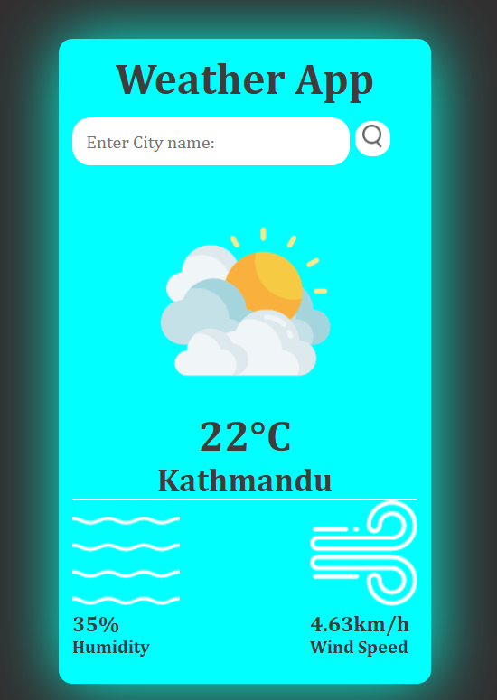

# Weather App



Simple Weather App.

## Description

This is a simple weather app that allows users to check real-time weather conditions for any given location. By entering a city name or geographic location, users can retrieve essential weather data such as temperature, humidity, wind speed, and a weather icon that visually represents the current weather. The app fetches this data from a weather API, such as OpenWeatherMap, and dynamically displays the information in a user-friendly interface. It is built using HTML for structure, CSS for styling, and JavaScript to handle API requests and update the UI with the latest weather details. This app offers an intuitive and efficient way to stay informed about the weather, making it a great project for practicing API integration and frontend development skills.

## Getting Started

### Dependencies

- A modern web browser (e.g., Google Chrome, Firefox, Edge)
- No special libraries or frameworks are required
- Operating system: Windows, Mac, or Linux

### Installing

1. Clone or download the repository to your local machine:

```sh
git clone https://github.com/Ashutosh-88/-Simple--Weather-App
```

2. Navigate to the project folder in your terminal:

```sh
cd -Simple--Weather-App
```

3. Open the `config.js` and follow the instruction to get API key and store it in `api_key` variable.

```sh
export const api_key = "PLACE_YOUR_API_KEY_HERE";
```

4. Open the `index.html` file in your web browser.

### Executing Program

1. To open the app, simply open the `index.html` file in your browser.
2. The input field will appear where you can input the city name.
3. Once the city name is entered, the app fetches the weather data from an API based on your location.
4. The app displays the current weather, including temperature, humidity, wind speed, and weather condition (e.g., sunny, cloudy).
5. You can enter a new city to get weather data for that area.
6. The app fetches and displays the updated weather information for the newly entered location.
7. The user can keep searching for different locations and view updated weather information.

## Help

If you run into any issues, ensure you are using a compatible browser and that JavaScript is enabled. If you need more help, please check the browser console for any error messages.

## Authors

- [Ashutosh Tiwari](https://www.linkedin.com/in/ashutosh-tiwari-70b504190/)

## Version History

- 0.1
  - Initial Release

## License

This project is licensed under the [MIT License](https://opensource.org/licenses/MIT) - see the LICENSE.md file for details.
